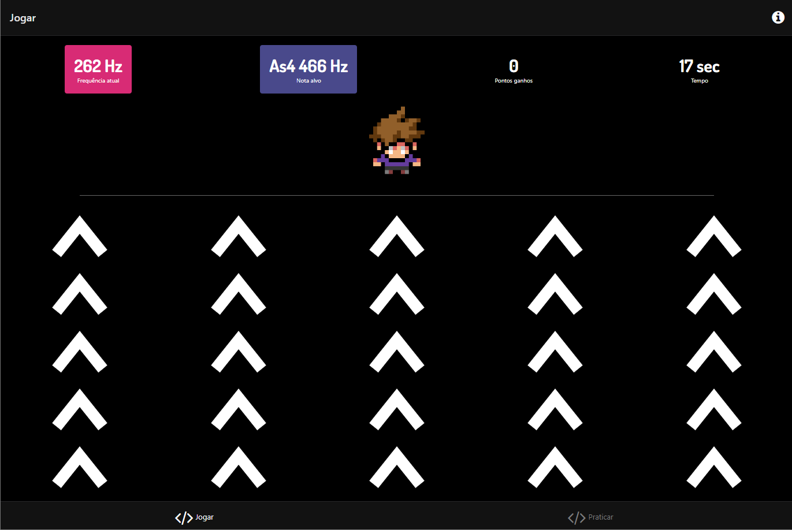
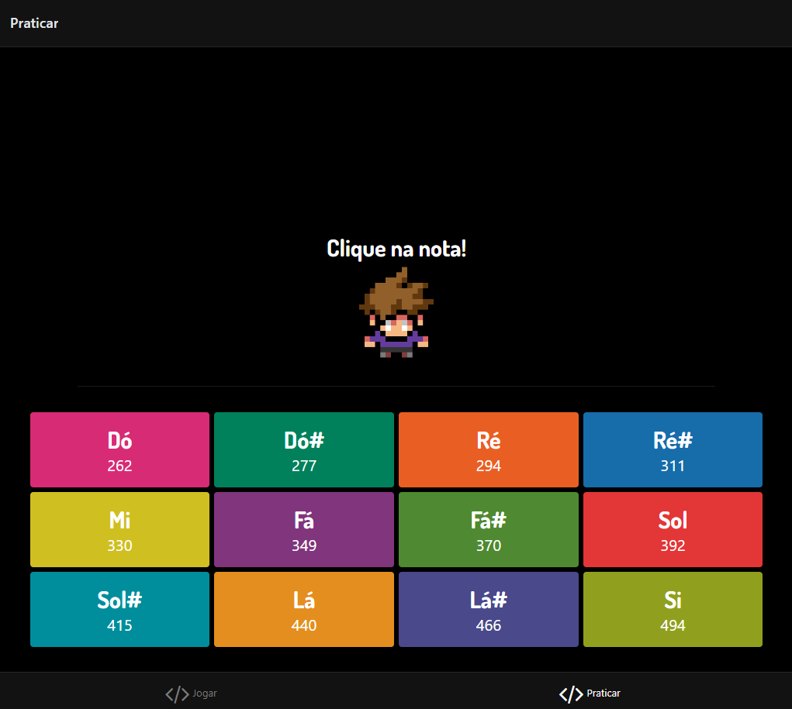

<p align="center">
  
</p>

> A music game that through colors, patterns and a beautiful history
> wants to help you to practice music tunning.

## Motivation

Usually we need to tune our instruments to play music, and we use a physical tuner or an app to do that. What if we reversed that order? What if we had to indicate what frequency for a particular note? It's with this premise and a simple story and gameplay that we created **BlindTuner**.

## Technologies

- [React-Native](https://reactnative.dev/): A framework for building native apps using React.
- [Expo](https://expo.io/): A framework and a platform to facilite run/build react-native applications.
- [ToneJS](https://tonejs.github.io/): A Web Audio framework for creating interactive music in the browser.

## Getting Started

> Optional command: Install [Yarn](https://yarnpkg.com/), you can use npm instead replacing `yarn` with `npm install`.

```bash
npm install -g yarn
```

Installing the dependencies:
```bash
cd blindturner
yarn
```

Running the project in the web (you can run it in your phone or an emulator):
```bash
yarn web
```

<p align="center">
  
</p>

---

A project made by:
- [José Danilo](http://github.com/jdaniloc)
- [Sofia Melo](https://github.com/Sofiamdl)
- [Caio Barreto](https://github.com/CaiolBarreto)
- [Pedro Queiroz](https://github.com/pccql)
- [Alex Damascena](https://github.com/apfdamascena)
- [Marcos André](https://github.com/MarcosND)
